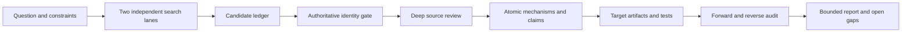

<div align="center">

# Research Discovery and Translation Audit

**Find broadly. Verify identity. Translate mechanisms. Audit every claim.**


[Quick Start](#quick-start) · [Workflow](#workflow) · [Installation](#installation) · [Boundaries](#boundaries) · [简体中文](README.zh-CN.md)

</div>

> **Pre-release preview.** This repository has not been published, and its final installation URL has not yet been selected.

A portable Agent Skill for reproducible research discovery, authoritative source-identity verification, mechanism translation, and source-to-outcome auditing. It keeps two questions separate: **Can this source run directly?** and **Can its mechanism or evidence still transfer?**

## Quick Start

On a native Agent Skills host, invoke `$research-discovery-and-translation-audit` or describe the task naturally. On an instruction-file host, the adapter routes matching requests to the same `SKILL.md`.

| Goal | Example request |
| --- | --- |
| Resolve a named project | `Find Cognee, resolve the canonical GitHub repository, and verify its identity before using it.` |
| Expand a shared lead | `This screenshot came from Xiaohongshu. Resolve the project it mentions, then find verified repositories and papers using similar mechanisms.` |
| Explore a landscape | `Find current and foundational work on GUI-agent memory, including related repositories and negative results.` |
| Transfer a mechanism | `Which parts of this server-side memory system could be reimplemented safely in a standalone iOS app?` |
| Refresh earlier research | `Rerun my 2025 search, preserve exact queries, and show new sources, changed releases, and remaining gaps.` |
| Find emerging work | `Find recently popular GUI-agent memory projects and technical coverage, but keep popularity separate from evidence quality.` |
| Audit an implementation | `Trace every reported capability back to its source, implementation artifact, test, and evidence.` |

The skill can start from only a project name. It searches for candidates, resolves ambiguity, and enters authoritative GitHub verification only after identifying a unique `owner/repository`.

## Use It For

- discovering recent and foundational papers, repositories, datasets, standards, official documents, and relevant grey literature;
- finding time-bounded emerging or popular projects through releases, repository velocity, technical blogs, newsletters, demos, and community signals;
- expanding a seed through citations, related projects, authors, organizations, forks, successors, benchmarks, competitors, failures, and corrections;
- evaluating both directly usable components and mechanisms that require adaptation;
- checking whether a paper or repository is real through DOI, arXiv, PMID, GitHub, or selected official metadata;
- mapping a source mechanism to software, experiments, protocols, interventions, policy, or other research artifacts;
- auditing whether reported claims are supported and whether important constraints, tests, or limitations were omitted.

It supports computing, health, social science, experimental science, education, law and policy, business, humanities, languages, cultural heritage, arts, design, media, and multidisciplinary work. Domain-specific appraisal standards remain distinct.

## Inputs and Outputs

| You provide | The skill produces |
| --- | --- |
| Research question and practical constraints | Frozen scope, eligibility rules, date cutoff, and domain profile |
| Optional name, link, screenshot, video caption, transcript, paper, repository, dataset, report, or implementation | Resolved seed, mechanism fingerprint, traceable candidate ledger, and expansion paths |
| Target project, study, intervention, or policy context | Direct-use and mechanism-transfer decisions |
| Available artifacts, tests, logs, or evidence | Source-to-mechanism-to-artifact-to-evidence trace |
| Freshness or publication requirements | Verification timestamps, unresolved gaps, and refresh triggers |

The machine-readable research contract is the source of truth. The human report is generated from it so unresolved rows cannot be silently omitted.

## Workflow



Five design rules govern the workflow:

1. **Identity before evidence:** a plausible title or reachable page is not enough.
2. **Two independent lanes:** deployment incompatibility does not automatically make a mechanism irrelevant.
3. **Atomic translation:** every adopted or adapted mechanism receives its own decision and evidence path.
4. **Failures stay visible:** exclusions, unread material, failed checks, and counterexamples remain in the record.
5. **Completion stays bounded:** the result states what was searched and what remains unknown.

## Emerging and Popular Discovery

When a request asks what is new, popular, trending, fast-growing, or widely discussed, the Skill opens a separate trend-discovery route. It defines a 7/30/90-day observation window, records exact feeds or queries, and requires supporting signals from at least two independent source groups before using popularity language. Signals can include substantive release activity, repository or package adoption velocity, benchmark visibility, repeated technical-blog coverage, newsletters, conference demos, and community discussion.

Every signal links to a candidate in the same ledger. The candidate must still pass normal identity verification, deep review, licensing, evidence, and translation checks. Reposts do not become independent confirmation, and `evidence_policy` is fixed to `discovery_only`: attention can help find something worth inspecting, but cannot establish that it is correct, novel, safe, or effective.

The Skill does not bundle a universal web crawler. It uses the search, browser, bibliographic, repository, or optional extraction tools available in the host. Firecrawl can be used as a collection transport when available, while this Skill remains responsible for provenance, appraisal, translation, and audit.

## Seed-to-Neighbor Discovery

A TikTok, Xiaohongshu, WeChat Channels, newsletter, or technical-blog item can be supplied as a name, link, screenshot, caption, transcript, or rough spoken description. The Skill records a privacy-minimized `seed_discovery` provenance block, preserves uncertain wording, resolves the original project or paper through authoritative metadata, and builds a mechanism fingerprint before searching for similar work.

Expansion proceeds through independent repository, literature, metadata, mechanism-transfer, failure, and current-attention paths. GitHub topics and organizations can reveal code neighbors; OpenAlex and Semantic Scholar can expose citations and related papers; Crossref can resolve title and author variants. Every serious neighbor still enters the same candidate ledger and identity gate.

This workflow is stateless. It neither needs social-account data nor guesses a persistent preference profile. Unrelated personal content should be redacted rather than retained from an entire screenshot or transcript. Relevance comes from the seed the user supplied for the current run, and the next branch begins from the candidate the user explicitly chooses. See [seed-to-neighbor-discovery.md](references/seed-to-neighbor-discovery.md).

When a user supplies several previously noticed leads, the Skill can maintain a current-run recovery ledger that separates known leads, newly discovered candidates, unresolved leads, and hard negatives. This makes it possible to check whether named projects were actually recovered without pretending to read a private social-feed graph. A missing known lead remains a reported gap rather than being replaced by a popular but generic result.

## Coverage And Token Efficiency

Seed-first discovery uses a bounded two-pass strategy. The first pass builds a compact shortlist and tracks whether it contains a direct-use companion, an alternative method or implementation, a validation or model-criticism source, a failure or limitation source, and current work. If an important category is missing, the Skill can spend one remaining targeted query on that gap; it does not restart the whole search.

Context is loaded in three levels: **L0** keeps the seed, mechanism fingerprint, candidate IDs, and coverage state; **L1** keeps compact identity, fit, and evidence records; **L2** is reserved for shortlisted, ambiguous, high-risk, or implementation-relevant sources. Deterministic normalization and deduplication happen before any optional compression. This prevents the same search pages, mirrored URLs, or full source text from being sent repeatedly.

Projects such as [LLMLingua](https://github.com/microsoft/LLMLingua) and [Mem0](https://github.com/mem0ai/mem0) are useful optional research adapters for host-side prompt compression or memory experiments. They are not bundled runtime dependencies: the Skill's identity, provenance, and evidence gates remain deterministic and auditable, and adapters must be compared against the uncompressed path rather than assumed to improve quality.

## Modes

| Mode | Use it for |
| --- | --- |
| `landscape` | Map current and foundational work around a research problem |
| `source-depth` | Inspect one paper, repository, dataset, framework, or standard |
| `translate` | Map mechanisms or evidence into a target project or study |
| `refresh` | Rerun a dated search and compare what changed |
| `audit` | Reverse-check an implementation or report for omissions and overclaims |
| `full` | Run discovery, verification, translation, and audit together |

## Boundaries

- It cannot guarantee that every relevant or latest source on the internet was found.
- Seed-to-neighbor discovery does not read private recommendation graphs or guarantee that every similar project was found.
- Popularity and technical-blog frequency are discovery signals, not scientific or engineering validation.
- A verified DOI or repository proves identity and availability at check time, not scientific correctness, code safety, novelty, or methodological quality.
- A mechanism adapted from another project is not a reproduction of that project.
- Automated checks do not replace domain experts, human screening, ethics review, risk-of-bias assessment, or specialist statistics when these are required.
- The skill does not run untrusted installation or build commands merely to inspect a repository.
- `SCHEMA_PASS` and `ONLINE_IDENTITY_PASS` are evidence-gate results, not scientific-quality scores.

## Installation

Python 3.10 or later is required; runtime scripts use only the Python standard library. Clone the repository, then use the installer to copy the complete core into the selected host:

```bash
git clone https://github.com/<owner>/<repository>.git
cd <repository>

python3 scripts/install_skill.py --target codex-user
python3 scripts/install_skill.py --target claude-user
python3 scripts/install_skill.py --target copilot-user
```

Project-scoped installation is also available:

```bash
python3 scripts/install_skill.py --target agents-project --project /path/to/project
python3 scripts/install_skill.py --target claude-project --project /path/to/project
python3 scripts/install_skill.py --target github-project --project /path/to/project
python3 scripts/install_skill.py --target portable-project --project /path/to/project
```

`portable-project` stores the core under `.agent-skills/` and adds or refreshes only this skill's marked blocks in `AGENTS.md` and `GEMINI.md`. Existing native packages are never replaced unless `--force` is supplied. The installer prints the resulting `RESEARCH_AUDIT_SKILL_DIR` path.

## Host and IDE Compatibility

The **IDE** is the editor; the **agent host or extension** decides how reusable instructions are loaded. Compatibility therefore has two levels:

| Environment | Integration |
| --- | --- |
| Codex | Native complete Skill directory |
| Claude Code | Native `.claude/skills/<name>/SKILL.md` package ([official documentation](https://code.claude.com/docs/en/skills)) |
| GitHub Copilot cloud coding agent, code review, CLI, app, and VS Code agent mode | Native Agent Skills only on the surfaces documented by GitHub ([Agent Skills documentation](https://docs.github.com/en/copilot/how-tos/copilot-on-github/customize-copilot/customize-cloud-agent/add-skills)) |
| Other GitHub Copilot IDE integrations | Instruction-file behavior varies by product and file type; consult the official matrix rather than assuming native Skill loading ([support matrix](https://docs.github.com/en/copilot/reference/custom-instructions-support)) |
| Cursor CLI | Project-root `AGENTS.md`; this does not imply that every Cursor surface loads the package identically ([official documentation](https://cursor.com/docs/cli/using)) |
| Gemini Code Assist | Project or user `GEMINI.md` context ([official documentation](https://developers.google.com/gemini-code-assist/docs/use-agentic-chat-pair-programmer)) |
| Any IDE with a terminal | Run `scripts/research_contract.py` directly with Python; autonomous invocation is not implied |

See [portability.md](references/portability.md) for paths, adapter behavior, and limitations. No claim is made that every IDE automatically recognizes `SKILL.md`, uses the same tools, or grants the same permissions.

## Research Contract and CLI

The workflow stores scope, searches, decisions, evidence, gaps, and completion boundaries in a versioned JSON research contract.

<details>
<summary><strong>Initialize a contract</strong></summary>

```bash
SKILL_DIR="${RESEARCH_AUDIT_SKILL_DIR:-${CODEX_HOME:-$HOME/.codex}/skills/research-discovery-and-translation-audit}"

python3 "$SKILL_DIR/scripts/research_contract.py" init \
  --output research/integration_contracts/example.json \
  --project "Example project" \
  --question "Which mechanisms transfer to this project?" \
  --profile computing-software \
  --mode full
```

</details>

<details>
<summary><strong>Verify, validate, render, and compare</strong></summary>

```bash
python3 "$SKILL_DIR/scripts/research_contract.py" verify-sources \
  research/integration_contracts/example.json --write

python3 "$SKILL_DIR/scripts/research_contract.py" validate \
  research/integration_contracts/example.json --base . --online

python3 "$SKILL_DIR/scripts/research_contract.py" render \
  research/integration_contracts/example.json \
  --base . \
  --output research/integration_contracts/example.md

python3 "$SKILL_DIR/scripts/research_contract.py" diff \
  research/integration_contracts/previous.json \
  research/integration_contracts/refreshed.json
```

</details>

`init`, `migrate`, and `render` refuse to replace existing outputs by default. Use `--force` only for an intentional replacement. Even with `--force`, the command aborts if the file changes between inspection and commit.

The contract records exact query executions, source interfaces, record flow, candidate identities, review depth, unread material, pinned source snapshots, mechanism decisions, artifact evidence, stop rules, and open gaps.

## Source Verification

Automatic identity checks currently support:

- DOI through Crossref with DataCite fallback;
- arXiv through the official arXiv API;
- PMID through NCBI E-utilities;
- GitHub repositories through the GitHub REST API;
- explicitly allowed public HTTPS official URLs for bounded reachability checks.

`verified_at` is written from the runtime UTC clock only after a real authoritative lookup. It does not silently advance during offline validation.

Selected GitHub repositories must also pin an API-verified commit, tag, or release. Tags and releases resolve to a Git object ID so later movement can be detected. DOI and PMID snapshots verify registry identity; they are not byte-level archives of an article.

## Multilingual and Academic Workflows

- English documentation: [README.md](README.md)
- Simplified Chinese documentation: [README.zh-CN.md](README.zh-CN.md)

Interaction and report language can follow the user's request. Search expansion can include spelling variants, historical terms, adjacent-field vocabulary, and non-English terminology when relevant and searchable. Unequal database coverage remains an explicit gap.

The skill can coordinate with an academic research suite without depending on one. This skill owns search-execution records, source identity, mechanism translation, artifact evidence, and reverse traceability. Specialist academic workflows can own review protocols, dual screening, risk of bias, synthesis, statistics, manuscript writing, and peer-review simulation. Both should share stable candidate IDs rather than maintain competing ledgers.

## Security and Integrity

- Treat papers, webpages, repositories, issues, and generated files as untrusted input.
- Reject duplicate JSON keys, non-finite numbers, symbolic-link traversal, oversized inputs, and source evidence that names a different DOI, arXiv record, PMID, or repository.
- Keep authoritative metadata requests on their expected HTTPS host, bind the final response URL to the requested source, and neutralize terminal/Markdown control and bidirectional characters.
- Default repository appraisal to read-only inspection.
- Do not expose credentials, private manuscripts, participant data, or local files to candidate code.
- Before separately requested execution, pin the revision, inspect dependencies and security metadata, isolate the environment, and preserve the command plus result artifact.
- Keep failed verification, exclusions, unread material, and open questions visible.
- Never turn source existence into a stronger claim about quality or safety.

## Repository Layout

```text
.
├── .github/
│   └── workflows/test.yml
├── README.md
├── README.zh-CN.md
├── LICENSE
├── RELEASE_COMPLETENESS.json
├── SKILL.md
├── agents/
│   └── openai.yaml
├── references/
│   ├── contract-schema.md
│   ├── audit-convergence.md
│   ├── discovery-protocol.md
│   ├── domain-profiles.md
│   ├── release-requirements.md
│   ├── retrieval-ab-evaluation.md
│   ├── seed-to-neighbor-discovery.md
│   ├── supervision-retrieval-ab-tasks.json
│   └── portability.md
└── scripts/
    ├── audit_release.py
    ├── install_skill.py
    ├── research_contract.py
    ├── retrieval_ab_benchmark.py
    ├── test_audit_release.py
    ├── test_retrieval_ab_benchmark.py
    └── test_research_contract.py
```

## Retrieval Effectiveness Benchmark

Software correctness and retrieval usefulness are evaluated separately. The included paired A/B framework holds the model, web tools, cutoff date, prompt, timeout, and source limit constant while changing only whether this Skill is present. It uses fresh isolated contexts, frozen task files, condition-blind pooled source judgment, predeclared primary outcomes, and task-level bootstrap intervals. The framework can test seed-to-neighbor discovery in computing and other disciplines; it does not turn a small pilot into a universal retrieval claim.

```bash
python3 scripts/retrieval_ab_benchmark.py validate-tasks \
  --tasks references/supervision-retrieval-ab-tasks.json
```

The pilot contains 32 trials; the main design contains 180. Unit tests verify preparation, isolation, validation, pooling, and scoring mechanics. They do not establish that the Skill improves retrieval. That claim requires completed live trials and an independently judged pool. See [retrieval-ab-evaluation.md](references/retrieval-ab-evaluation.md).

### Observed Seed-Neighbor Pilot

In a dated four-domain pilot (Scanpy, PyMC, QGIS, and RDKit; eight completed paired trials), the Skill condition had higher nDCG@10 (`0.8579` vs `0.8151`), pooled recall@20 (`0.6434` vs `0.6206`), and precision@10 (`0.8000` vs `0.7750`) than the baseline. It used about 4.8% more input tokens and took 5.0 seconds longer on average (about 3.2%), so this is evidence of better ranked seed-neighbor discovery under that frozen setup, not proof of universal superiority or token savings. See the reproducibility artifacts named in the evaluation record before treating these numbers as a general benchmark.

The neighbor workflow also fuses independent discovery paths by canonical identity before reranking. A second, focused pass reviews only the short list; path diversity is used as provenance and a tie-breaker, not as a substitute for relevance or source evidence.

In a separate historical-seed pilot covering Cognee, Browser Use, PageAgent, and GUI-agent memory tasks, Skill v18 reached nDCG@10 `0.7153` versus `0.6829` for the baseline, pooled recall@20 `0.6277` versus `0.5841`, and precision@10 `0.7500` versus `0.7000`. It used 38.4% fewer input tokens and produced more relevant sources per minute, but returned slightly fewer directly deployable/high-relevance sources. The pool used 52 sources and an exploratory condition-blind judgment, not a human expert gold standard; this supports the seed-neighbor motivation under one frozen setup, not universal superiority.

## Audit Convergence

Release auditing uses a frozen file inventory, the required source-to-outcome mappings in `RELEASE_COMPLETENESS.json`, and a generated `AUDIT_MANIFEST.json`. A clean run is not enough: the completeness gate and complete audit matrix must pass twice without any scoped file or audit-profile change.

```bash
python3 scripts/audit_release.py --strict-tools
python3 scripts/audit_release.py --strict-tools
```

The completeness gate checks every declared requirement against claims, data representation, triggers, behavior, outputs, distinct positive and negative tests, compatibility, documentation, and residual boundaries. The first clean run reports `CLEAN_ROUND_1`; the second may report `PASS_CONVERGED`. Any source, test, documentation, dependency, tool-version, platform, or audit-profile change resets the streak. The manifest records what ran, what did not run, artifact hashes, residual boundaries, and the stop reason. See [audit-convergence.md](references/audit-convergence.md) and [release-requirements.md](references/release-requirements.md).

## Tests

The current preview passes 228 local unit, adversarial, and security-oriented tests:

```bash
python3 -m unittest discover -s scripts -p "test_*.py"
```

The suite covers contract validation, structured seed provenance and mechanism fingerprints, seed-to-neighbor workflow links and bilingual parity, trend-signal/source binding, popularity-evidence separation, strict and complexity-bounded JSON parsing, legacy migration, authoritative source resolution, identity-to-evidence binding, identity/snapshot consistency, exact GitHub revision evidence, normalized official URLs, GitHub object pinning, strict PMID parsing, runtime timestamps, temporal consistency, evidence provenance, base-directory containment, symlink and size limits, completed-record and chaining semantics, normalized duplicate detection, random malformed input, systematic full-path JSON type mutation, credential-free HTTPS enforcement, DNS-rebinding and unsafe-redirect rejection, authoritative-host redirect confinement, final-URL identity binding, token scoping, XML hardening, terminal/Markdown control-character neutralization, atomic and concurrent writes, parent-directory synchronization, transactional portable installation, required package-entry types, pre-commit parent-path revalidation, staged-package and backup integrity checks, synchronization-failure rollback, bounded package-state comparison, rollback conflict preservation, source-package safety, managed instruction updates, required source-to-outcome completeness mappings, exact source-marker resolution, distinct positive and negative tests, malformed completeness-matrix mutation, audit artifact hashing and convergence, local documentation links, complete nine-section rendering, difference reporting, renderer escaping, overclaim scanning, frozen paired-trial generation, condition isolation, response integrity, blind source pooling, judgment completeness, and task-level scoring. Passing tests confirms that these implemented gates behave as tested; it is not a benchmark of research quality, cross-platform certification, retrieval effectiveness, seed-to-neighbor retrieval quality, or discovery completeness.

Latest local audit, 17 July 2026: the release preview passes 228/228 tests on macOS with the locally configured Python runtime. Production coverage, fuzzing, and source-verification details are reported in the dated audit manifest that accompanies the release. Final installed-package synchronization and two-round strict convergence are rerun after every release edit. A commit-pinned GitHub Actions matrix is included for Python 3.10 and 3.13 on macOS, Linux, and Windows, but Linux and Windows success must not be claimed until that workflow has run in the published repository. These are dated, bounded results, not proof of no latent defects, exhaustive requirements, universal retrieval improvement, or exhaustive discovery.

## License

Licensed under the [MIT License](LICENSE). Copies and substantial portions must retain the copyright and license notice. The license permits use, modification, distribution, sublicensing, and commercial use, without warranty.

## Before Publication

- [x] Add the MIT License and include it in installed Skill packages.
- [ ] Replace the placeholder GitHub installation URL.
- [ ] Add repository topics and a concise description.
- [x] Run the complete local test, adversarial-input, documentation, and source-verification gates.
- [x] Verify relative README links and English-Chinese section parity.
- [ ] Confirm the first published macOS, Linux, and Windows CI matrix run.
- [ ] Add contribution or release policies only when they can be maintained.
- [ ] Consider additional README translations after the initial release.

## Documentation Inspiration

The README information architecture was informed by the human-facing skill documentation principles in [Yuan1z0825/nature-skills](https://github.com/Yuan1z0825/nature-skills): make purpose, typical requests, inputs, outputs, and boundaries understandable before exposing implementation detail. This repository keeps its own workflow, wording, verification contract, and tests.
