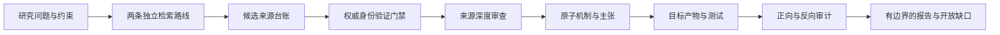

<div align="center">

# Research Source Radar

**给它一个项目名、论文、截图或模糊线索，它帮你找到真实来源、相关工作，以及哪些东西真的能用。**


[快速开始](#快速开始) · [工作流程](#工作流程) · [安装](#安装) · [能力边界](#能力边界) · [English](README.md)

</div>

> **公开预览。** 仓库已经公开，可供检查和使用；跨平台 CI 与更大规模的独立评估仍在进行。

Research Source Radar 会把一条模糊的科研线索整理成一张经过检查的研究地图。它可以找到原始论文或仓库，扩展相关工作，检查来源是否真实，并说明哪些内容可以直接使用、哪些内容只能作为可迁移的思路。如果证据不足，它会保留缺口，而不是编造一个看起来完整的答案。

你可以给它项目名、链接、截图、视频文案、论文、仓库或研究问题。它会返回已验证的来源、相关候选、排序理由、实现或研究限制，以及之后可以复查的证据链。

## 快速开始

公开名称是 **Research Source Radar**。为了保持已有安装兼容性，在原生支持 Agent Skills 的宿主中，内部调用名仍是 `$research-discovery-and-translation-audit`；你也可以直接描述任务。在指令文件型宿主中，适配入口会把匹配任务路由到同一份 `SKILL.md`。

| 目标 | 可以这样说 |
| --- | --- |
| 找到指定项目 | `找到 Cognee，解析唯一的 GitHub 仓库，并在使用前验证它的身份。` |
| 扩展一条分享线索 | `这张截图来自小红书。先确认里面提到的项目，再寻找机制相似且身份可验证的仓库和论文。` |
| 梳理研究版图 | `查找 GUI Agent 记忆方向的近期与奠基工作，包括相关仓库和负面结果。` |
| 迁移机制 | `这个服务端记忆系统中，哪些机制可以安全地重写到独立运行的 iOS App？` |
| 更新已有检索 | `重跑我在 2025 年做的检索，保留精确查询，并列出新增来源、版本变化和剩余缺口。` |
| 发现新兴工作 | `寻找最近受到关注的 GUI Agent 记忆项目和技术报道，但把热度与证据质量分开。` |
| 审计已有实现 | `把每项能力反向追溯到来源、实现产物、测试和证据。` |

只给一个项目名字也可以。Skill 会先搜索候选并消除同名歧义，只有解析成唯一的 `owner/repository` 后才进入 GitHub 权威验证。

## 适合用它做什么

- 发现近期和奠基论文、代码仓库、数据集、标准、官方文档及相关灰色文献；
- 通过版本发布、仓库增长、技术博客、newsletter、演示和社区信号发现有时间边界的新兴或热门项目；
- 从一个种子扩展到引用关系、相关项目、作者和组织、fork、继任项目、benchmark、竞争方案、失败与纠错资料；
- 分别评价可以直接使用的组件，以及需要适配后才能迁移的机制；
- 通过 DOI、arXiv、PMID、GitHub 或部分官方元数据确认来源是否真实存在；
- 把来源机制映射到软件、实验、协议、干预措施、政策或其他研究产物；
- 审计报告主张是否有证据，以及约束、测试或限制是否被遗漏。

它适用于计算机、健康、社会科学、实验科学、教育、法律与政策、商业管理、人文、语言、文化遗产、艺术、设计、传媒和多学科研究，但不会把不同学科压成同一套证据标准。

## 输入与产出

| 你需要提供 | Skill 会产出 |
| --- | --- |
| 研究问题与现实约束 | 固定的范围、纳入规则、截止日期和学科配置 |
| 可选的名称、链接、截图、视频文案、转写、论文、仓库、数据集、报告或实现 | 已解析种子、机制指纹、可追溯候选台账与扩展路径 |
| 目标项目、研究、干预措施或政策场景 | 直接使用与机制迁移决策 |
| 已有产物、测试、日志或证据 | 来源到机制、产物和证据的追溯链 |
| 时效或发布要求 | 验证时间、未解决缺口和下次更新触发条件 |

机器可读的研究合同是事实主来源。面向人的报告从合同生成，因此不能为了让结果显得完整而偷偷删掉未解决条目。

## 工作流程



工作流遵守五条设计原则：

1. **先验证身份，再使用证据：** 标题看起来合理或网页能打开都不够。
2. **保留两条独立路线：** 不能直接部署，不等于底层机制没有价值。
3. **按原子机制迁移：** 每个采用或适配的机制都必须有独立决策和证据路径。
4. **失败保持可见：** 排除项、未读材料、失败验证和反例都保留在记录中。
5. **完成声明必须有边界：** 只说明实际查了什么，以及还有什么不知道。

## 新兴与热门内容发现

当请求涉及“最新、热门、趋势、增长快或讨论度高”时，Skill 会启动独立的趋势发现路线。它先定义 7/30/90 天观察窗口，记录精确查询或 feed，并要求同一候选至少获得两个相互独立来源组的支持信号，才使用“热门”这样的描述。信号可以包括实质性版本发布、仓库或包采用速度、benchmark 可见度、多篇技术博客报道、newsletter、会议演示和社区讨论。

每条信号都会绑定同一候选台账中的项目。候选仍然必须通过常规的身份验证、深度审查、许可证、证据和机制迁移门禁。转载不能被计算成独立确认，`evidence_policy` 固定为 `discovery_only`：热度可以帮助找到值得检查的东西，但不能证明它正确、新颖、安全或有效。

Skill 本身不捆绑通用全网爬虫，而是使用宿主可用的搜索、浏览器、文献数据库、仓库接口或可选内容提取工具。若环境提供 Firecrawl，可以把它作为采集传输层；来源追溯、评价、迁移和审计仍由本 Skill 负责。

## 线索到邻近项目发现

你可以把抖音、小红书、视频号、newsletter 或技术博客里的项目，以名称、链接、截图、文案、转写或大概的口述描述发来。Skill 会先记录隐私最小化的 `seed_discovery` 来源区块，保留不确定写法，通过权威元数据确认原始项目或论文，再提取机制指纹并寻找相似工作。

扩展会分别经过仓库、论文、元数据、机制迁移、失败资料和近期关注度路线。GitHub topics 与组织仓库用于发现代码邻居；OpenAlex 和 Semantic Scholar 用于扩展引用和相关论文；Crossref 用于解析标题与作者变体。每个重要候选仍然进入同一候选台账和身份门禁。

这是一条无状态流程：不需要社交账号数据，也不会猜测长期兴趣画像。整张截图或转写中的无关个人内容应先删减，而不是长期保存。本次相关性由你主动提供的种子决定，下一步从你明确选中的候选继续展开。详见 [seed-to-neighbor-discovery.md](references/seed-to-neighbor-discovery.md)。

## 覆盖面与 Token 效率

线索优先检索采用有界的两阶段策略。第一阶段先生成紧凑候选集，并记录其中是否覆盖直接可用的配套方案、替代方法或实现、验证或模型批评资料、失败或限制资料以及近期工作。如果重要类别缺失，Skill 最多使用一次剩余预算做定向补缺，不会重新启动整套搜索。

上下文分为三层加载：**L0** 只保留种子、机制指纹、候选 ID 和覆盖状态；**L1** 保留紧凑的身份、适配性和证据记录；**L2** 只用于最终候选、身份有歧义、高风险或需要落地的来源。所有可确定的规范化和去重都在可选压缩前完成，避免反复发送相同搜索页、镜像 URL 或完整来源文本。

[LLMLingua](https://github.com/microsoft/LLMLingua) 和 [Mem0](https://github.com/mem0ai/mem0) 可以作为宿主侧 prompt 压缩或记忆实验的可选适配器，但不会作为运行时依赖打包进来。身份、来源和证据门禁仍保持确定性和可审计；任何适配器都必须和未压缩路径进行对照，而不能默认会提升质量。

## 工作模式

| 模式 | 适用场景 |
| --- | --- |
| `landscape` | 梳理一个问题的近期研究和奠基工作 |
| `source-depth` | 深入检查一篇论文、仓库、数据集、框架或标准 |
| `translate` | 将来源机制或证据映射到目标项目或研究设计 |
| `refresh` | 按日期重跑检索并比较发生了什么变化 |
| `audit` | 反向审计实现或报告，发现遗漏与过度主张 |
| `full` | 串联发现、验证、迁移和审计 |

## 能力边界

- 不能保证找到了互联网上所有相关或最新来源。
- 线索扩展不会读取平台的私有推荐图，也不能保证找到所有相似项目。
- 热度和技术博客出现频率只是发现信号，不是科研或工程验证。
- DOI 或 GitHub 仓库验证通过，只能证明验证时可以由权威服务解析，不能证明论文正确、代码安全、方法新颖或质量可靠。
- 借鉴并重新实现一个机制，不等于复现了原项目。
- 当研究需要领域专家、人工筛选、伦理审批、偏倚风险评价或专业统计时，自动检查不能替代这些环节。
- 不会为了检查一个仓库就运行其中不可信的安装或构建命令。
- `SCHEMA_PASS` 和 `ONLINE_IDENTITY_PASS` 是证据门禁结果，不是科研质量评分。

## 安装

需要 Python 3.10 或更高版本；运行时脚本只依赖 Python 标准库。克隆仓库后，使用安装器把完整核心复制到对应宿主：

```bash
git clone https://github.com/byby123byby/by-Research-Source-Radar.git
cd by-Research-Source-Radar

python3 scripts/install_skill.py --target codex-user
python3 scripts/install_skill.py --target claude-user
python3 scripts/install_skill.py --target copilot-user
```

也可以安装到单个项目：

```bash
python3 scripts/install_skill.py --target agents-project --project /path/to/project
python3 scripts/install_skill.py --target claude-project --project /path/to/project
python3 scripts/install_skill.py --target github-project --project /path/to/project
python3 scripts/install_skill.py --target portable-project --project /path/to/project
```

`portable-project` 会把核心保存到 `.agent-skills/`，并且只增加或更新 `AGENTS.md` 与 `GEMINI.md` 中属于本 Skill 的标记区块。已有原生 Skill 不会被静默替换，除非明确传入 `--force`。安装器会输出最终的 `RESEARCH_AUDIT_SKILL_DIR` 路径。

## 宿主与 IDE 兼容性

**IDE** 是编辑器，真正决定如何加载可复用指令的是其中的 **Agent 宿主或扩展**。因此兼容性分为两个层次：

| 环境 | 接入方式 |
| --- | --- |
| Codex | 原生完整 Skill 目录 |
| Claude Code | 原生 `.claude/skills/<name>/SKILL.md` 包（[官方文档](https://code.claude.com/docs/en/skills)） |
| GitHub Copilot 云端 coding agent、code review、CLI、App 和 VS Code agent mode | 只在 GitHub 官方列出的界面使用原生 Agent Skills（[Agent Skills 文档](https://docs.github.com/en/copilot/how-tos/copilot-on-github/customize-copilot/customize-cloud-agent/add-skills)） |
| 其他 GitHub Copilot IDE 集成 | 指令文件行为因产品和文件类型而异，应查官方矩阵，不能默认原生加载 Skill（[支持矩阵](https://docs.github.com/en/copilot/reference/custom-instructions-support)） |
| Cursor CLI | 读取项目根目录 `AGENTS.md`；这不代表所有 Cursor 界面都以相同方式加载该包（[官方文档](https://cursor.com/docs/cli/using)） |
| Gemini Code Assist | 项目或用户级 `GEMINI.md`（[官方文档](https://developers.google.com/gemini-code-assist/docs/use-agentic-chat-pair-programmer)） |
| 任何带终端的 IDE | 直接用 Python 运行 `scripts/research_contract.py`，但不代表会自动触发 Agent 工作流 |

路径、适配行为和限制见 [portability.md](references/portability.md)。这里不会声称所有 IDE 都能自动识别 `SKILL.md`，也不会声称它们具有相同工具或权限。

## 研究合同与命令行

工作流使用带版本的 JSON 研究合同保存范围、检索、决策、证据、缺口和完成边界。

<details>
<summary><strong>初始化研究合同</strong></summary>

```bash
SKILL_DIR="${RESEARCH_AUDIT_SKILL_DIR:-${CODEX_HOME:-$HOME/.codex}/skills/research-discovery-and-translation-audit}"

python3 "$SKILL_DIR/scripts/research_contract.py" init \
  --output research/integration_contracts/example.json \
  --project "示例项目" \
  --question "哪些机制可以迁移到这个项目？" \
  --profile computing-software \
  --mode full
```

</details>

<details>
<summary><strong>验证、校验、生成报告和比较更新</strong></summary>

```bash
python3 "$SKILL_DIR/scripts/research_contract.py" verify-sources \
  research/integration_contracts/example.json --write

python3 "$SKILL_DIR/scripts/research_contract.py" validate \
  research/integration_contracts/example.json --base . --online

python3 "$SKILL_DIR/scripts/research_contract.py" render \
  research/integration_contracts/example.json \
  --base . \
  --output research/integration_contracts/example.md

python3 "$SKILL_DIR/scripts/research_contract.py" diff \
  research/integration_contracts/previous.json \
  research/integration_contracts/refreshed.json
```

</details>

`init`、`migrate` 和 `render` 默认拒绝覆盖已有输出。只有明确要替换时才使用 `--force`；即使使用 `--force`，如果文件在检查与提交之间发生变化，命令也会中止。

研究合同会记录精确检索式、来源接口、结果流、候选身份、阅读深度、未读材料、固定来源版本、机制决策、产物证据、停止规则和开放缺口。

## 来源身份验证

目前支持的自动验证方式：

- DOI：Crossref，失败时回退到 DataCite；
- arXiv：官方 arXiv API；
- PMID：NCBI E-utilities；
- GitHub 仓库：GitHub REST API；
- 经明确允许的公开 HTTPS 官方网址：只做有边界的可访问性检查。

`verified_at` 只会在真实访问权威服务后，根据运行时 UTC 时钟写入。离线校验不会让它自动变成当前时间。

纳入或适配的 GitHub 项目还必须固定一个由 API 验证的 commit、tag 或 release。tag 和 release 会解析成 Git object ID，以便发现引用后来被移动。DOI 和 PMID 快照验证的是注册表身份，不是文章内容的逐字节归档。

## 多语言与学术工作流

- English：[README.md](README.md)
- 简体中文：[README.zh-CN.md](README.zh-CN.md)

交互和报告语言可以跟随用户请求。检索扩展可以在适用且可检索时加入拼写变体、历史名称、相邻学科术语和非英语词汇；不同数据库的语言覆盖差异仍然必须作为缺口保留。

这个 Skill 可以与学术研究套件协作，但不依赖某个特定套件。本 Skill 负责检索执行记录、来源身份、机制迁移、产物证据和反向追溯；专业学术工作流可以负责综述协议、双人筛选、偏倚风险、综合分析、统计、论文写作和同行评审模拟。两者应共享稳定的候选 ID，而不是维护互相冲突的台账。

## 安全与研究诚信

- 把论文、网页、仓库、issue 和生成文件视为不可信输入。
- 拒绝重复 JSON 键、非有限数字、符号链接穿越、超限输入，以及指向另一 DOI、arXiv、PMID 或仓库的伪证据。
- 权威元数据请求必须留在预期 HTTPS 主机，最终响应 URL 必须对应请求的来源；终端和 Markdown 中的控制字符、双向文本控制字符会被显式转义。
- 默认只读检查代码仓库。
- 不向候选代码暴露密钥、私人文稿、参与者数据或本地文件。
- 如果另行要求执行代码，先固定版本、检查依赖和安全信息、使用隔离环境，并保存命令及结果产物。
- 保留验证失败、排除项、未读材料和开放问题。
- 不能把“来源真实存在”升级成“来源质量可靠或实现安全”。

## 仓库结构

```text
.
├── .github/
│   └── workflows/test.yml
├── README.md
├── README.zh-CN.md
├── LICENSE
├── RELEASE_COMPLETENESS.json
├── SKILL.md
├── agents/
│   └── openai.yaml
├── references/
│   ├── contract-schema.md
│   ├── audit-convergence.md
│   ├── discovery-protocol.md
│   ├── domain-profiles.md
│   ├── release-requirements.md
│   ├── retrieval-ab-evaluation.md
│   ├── seed-to-neighbor-discovery.md
│   ├── supervision-retrieval-ab-tasks.json
│   └── portability.md
└── scripts/
    ├── audit_release.py
    ├── install_skill.py
    ├── research_contract.py
    ├── retrieval_ab_benchmark.py
    ├── test_audit_release.py
    ├── test_retrieval_ab_benchmark.py
    └── test_research_contract.py
```

## 检索效果 A/B Benchmark

软件正确性与检索实用性分开评价。内置的配对 A/B 框架固定模型、联网工具、截止日期、提示词、超时和来源数量，只改变是否加载本 Skill。每条 trial 使用独立上下文；任务文件冻结；两个条件的来源合并后去除条件标签，由人工盲评；主要指标和任务层 bootstrap 分析在运行前确定。这个框架可以评估计算机和其他学科的线索到邻近项目检索，但不会把小规模 pilot 包装成普遍的检索结论。

```bash
python3 scripts/retrieval_ab_benchmark.py validate-tasks \
  --tasks references/supervision-retrieval-ab-tasks.json
```

Pilot 包含 32 条 trial，主实验设计包含 180 条。单元测试只验证准备、隔离、校验、池化和评分机制按预期工作，并不能证明 Skill 提升了检索效果。只有完成真实联网 trial 和独立人工盲评后，才能形成有日期、有边界的效果主张。详见 [retrieval-ab-evaluation.md](references/retrieval-ab-evaluation.md)。

### 已观察到的线索邻近项目 Pilot

在一个固定日期、四个学科种子（Scanpy、PyMC、QGIS、RDKit）的 pilot 中，8 条配对 trial 全部完成。Skill 的 nDCG@10 为 `0.8579`，baseline 为 `0.8151`；pooled recall@20 为 `0.6434` 对 `0.6206`；precision@10 为 `0.8000` 对 `0.7750`。Skill 多用了约 4.8% 的输入 token，平均多耗时 5.0 秒（约 3.2%）。因此这支持“在该冻结条件下，线索到邻近项目的排序更好”，不支持普遍胜出或省 token 的结论。正式把这些数字推广到其他模型、日期或学科前，应先阅读评估记录中的可复现实验产物。

在另一组更贴近实际使用的历史 seed pilot 中，任务从 Cognee、Browser Use、PageAgent 和 GUI-agent memory 出发。当前 Skill v18 的 nDCG@10 为 `0.7153`，baseline 为 `0.6829`；pooled recall@20 为 `0.6277` 对 `0.5841`；precision@10 为 `0.7500` 对 `0.7000`。输入 token 少约 38.4%，单位时间有效来源更多，但直接可用或高相关来源略少。该结果只使用 52 个来源和探索性盲评，不是专家 gold standard；它支持原始的 seed-neighbor 动机，但不证明跨所有学科普遍更强。

## 审计收敛

发布审计会冻结文件清单，强制验证 `RELEASE_COMPLETENESS.json` 中从需求到结果的映射，并生成机器可读的 `AUDIT_MANIFEST.json`。一次干净运行还不够：完整性门禁和完整审计矩阵必须在所有受审文件和审计配置都未变化的情况下连续通过两次。

```bash
python3 scripts/audit_release.py --strict-tools
python3 scripts/audit_release.py --strict-tools
```

完整性门禁会逐项检查已登记需求对应的公开主张、数据表示、触发、行为、输出、相互独立的正向与失败测试、兼容性、文档和剩余边界。第一轮干净运行报告 `CLEAN_ROUND_1`，第二轮才可能报告 `PASS_CONVERGED`。任何源码、测试、文档、依赖、工具版本、平台或审计配置变化都会让连续计数重新开始。Manifest 会记录实际运行项、未运行项、产物哈希、剩余边界和停止理由。详见 [audit-convergence.md](references/audit-convergence.md) 和 [release-requirements.md](references/release-requirements.md)。

## 测试

当前预览已经通过 228 条本地单元测试、对抗性测试和安全相关测试：

```bash
python3 -m unittest discover -s scripts -p "test_*.py"
```

测试覆盖合同验证、结构化线索来源与机制指纹、线索到邻近项目流程链接与中英文一致性、趋势信号与来源绑定、热度和证据分离、严格且带复杂度上限的 JSON 解析、旧版本迁移、权威来源解析、身份与证据绑定、身份与快照一致性、GitHub revision 证据精确绑定、官方 URL 规范化、GitHub object 固定、严格 PMID 解析、运行时时间戳、时间一致性、证据来源、基础目录约束、符号链接与大小限制、完整结果流与引用链语义、规范化重复检测、随机畸形输入、完整字段路径 JSON 类型变异、无凭据 HTTPS 强制、DNS 重绑定与不安全重定向拦截、权威主机重定向限制、最终 URL 身份绑定、token 域名限制、XML 加固、终端与 Markdown 控制字符转义、原子与并发写入、父目录同步、事务式可移植安装、必需安装包入口类型、提交前父路径复核、staging 与 backup 完整性检查、同步失败回滚、有界安装包状态比较、回滚冲突保留、来源包安全、受控指令区块更新、强制的需求到结果完整性映射、精确源码标记解析、相互独立的正向与失败测试、畸形完整性矩阵变异、审计产物哈希与收敛、本地文档链接、完整九节报告渲染、差异报告、渲染转义、过度主张扫描、冻结配对 trial 生成、条件隔离、响应完整性、盲化来源池、人工标签完整性和任务层评分。测试通过只能证明这些已实现门禁按预期工作，不能作为科研质量、跨平台认证、检索效果、线索到邻近项目的检索质量或检索完整性的 benchmark。

最近一次本地审计日期为 2026 年 7 月 17 日：发布预览已经通过 228/228 条测试，生产覆盖率、模糊测试和来源验证细节以随版本生成的审计 Manifest 为准。每次发布修改后仍会重新进行安装包同步与两轮严格收敛审计。仓库包含固定到 Git commit 的 Python 3.10 与 3.13、macOS、Linux、Windows GitHub Actions 矩阵，但公开仓库实际运行前不能声称 Linux 和 Windows 已通过。这些都是有日期、有范围边界的结果，不证明不存在未知缺陷，不证明已登记的需求清单必然穷尽，不证明检索效果或线索到邻近项目的召回率已经普遍提升，也不证明检索已经穷尽。

## 许可证

本项目采用 [MIT License](LICENSE)。复制或分发本项目及其实质性部分时必须保留版权与许可声明。该许可证允许使用、修改、分发、再许可和商业使用，但不提供担保。

## 正式发布前

- [x] 添加 MIT License，并确保安装后的 Skill 包也保留许可证。
- [x] 替换 GitHub 安装地址占位符。
- [ ] 添加仓库 topics 和简短说明。
- [x] 完成本地测试、畸形输入、文档和来源验证门禁。
- [x] 检查 README 相对链接和中英文章节一致性。
- [ ] 确认公开仓库第一次 macOS、Linux 与 Windows CI 矩阵运行通过。
- [ ] 只有准备好持续维护时，才添加贡献规范或 release policy。
- [ ] 初次发布后再考虑增加其他语言版本。

## 文档设计参考

README 的信息架构参考了 [Yuan1z0825/nature-skills](https://github.com/Yuan1z0825/nature-skills) 面向人的 Skill 文档原则：先让读者理解用途、典型请求、输入、产出和边界，再展示实现细节。本仓库保留自己的工作流、文案、验证合同和测试。
